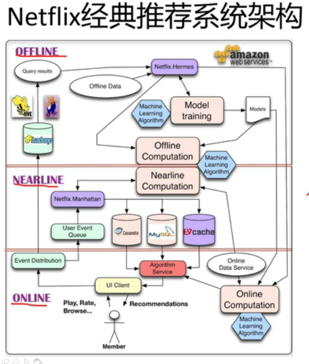
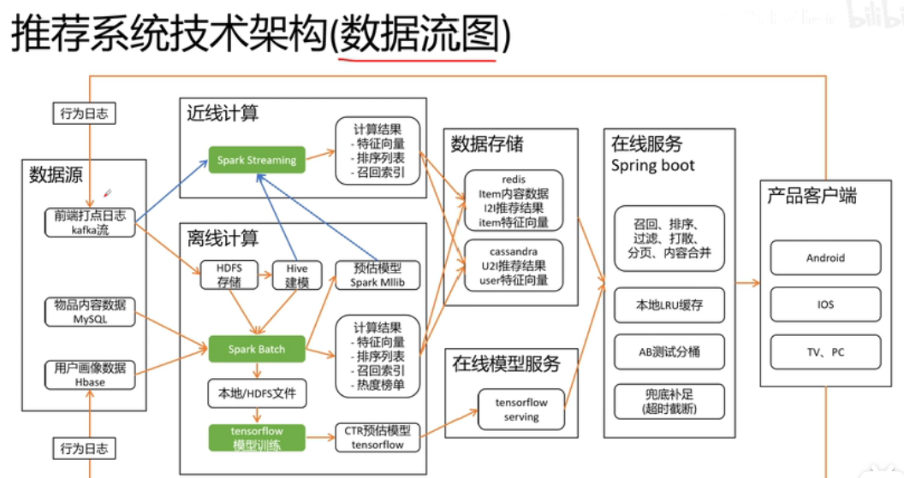
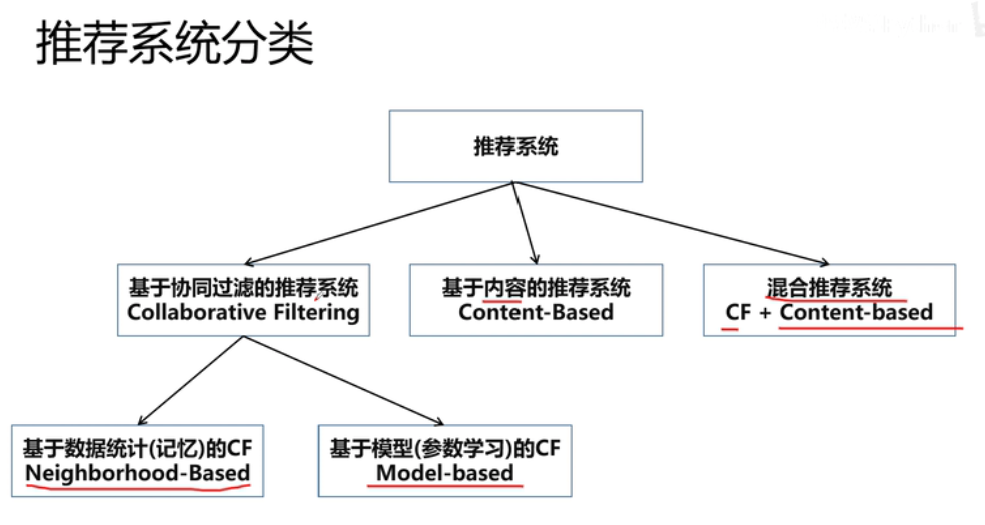
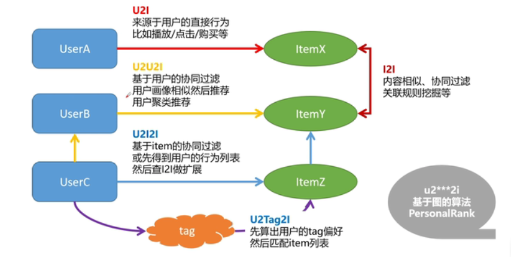
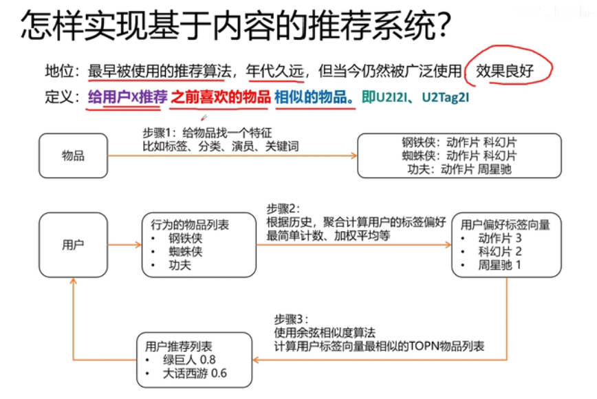
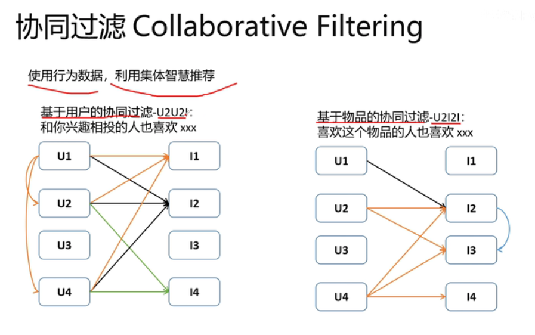
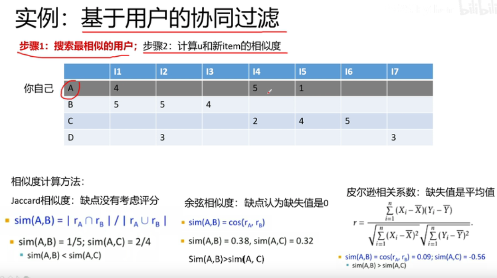
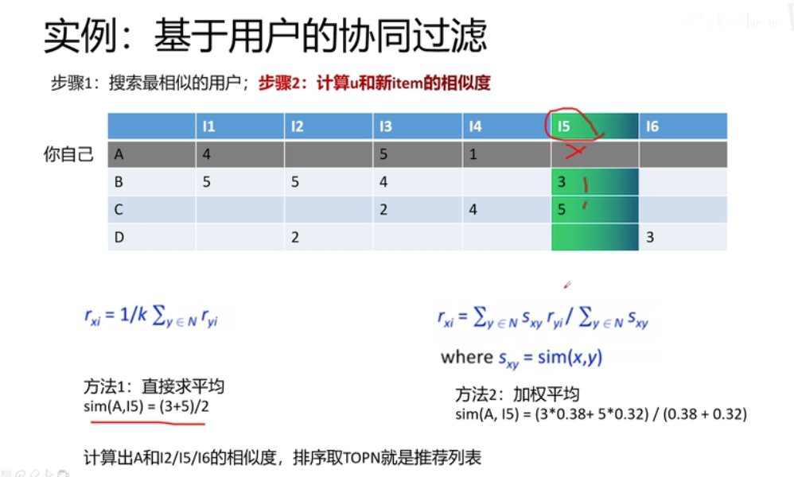
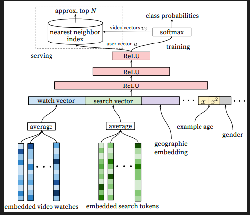

<!--
 * @Descripttion: 
 * @Author: hxp
 * @version: 
 * @Date: 2021-08-26 15:15:29
 * @LastEditors: hxp
 * @LastEditTime: 2021-09-06 15:44:28
-->

# 推荐算法
# 1 简介

## 1.1 推荐系统流程

### 1 召回
* 协同过滤召回
* 内容相似召回
* 图算法召回
* 热门召回
* 新课召回

### 2 排序
机器学习二分类算法
* LR
* GBDT
* NDD
* Wide&Deep

### 3 调整
* 去重
* 已读/已购过滤
* 在线过滤
* 热门补足
* 分页提取
* 合并内容信息
## 1.2 Netflix经典推荐系统架构

## 1.3 推荐系统架构图

# 2 召回

* 协同过滤召回
* 内容相似召回
* 图算法召回
* 热门召回
* 新课召回
* 聚类推荐
## 2.1 召回路径

## 2.2 CB(Content-based Recommendations)
基于内容的推荐

### 1 算法流程
1. Item Representation: 特征提取
2. Profile Learning: 计算用户特征向量
3. Recommendation Generation: 推荐生成
### 2 优缺点
* 优点:
  * 不需要其他用户数据
  * 能给具有独特口味的用户推荐
  * 可以推荐最新的冷门的物品
  * 容易做推荐结果的解释
* 缺点
  * 很难找到能够表达物体的标签,有时需要人工标签
  * 过于局限于自己的世界,很难挖掘出用户的潜在数据
  * 新用户没有行为,无法推荐

## 2.3 CF(CollaborativeFiltering) 协同过滤算法

## 2.4 YouTubeDNN
[YouTubeDNN](./anb00_paper/anb01_YouTubeDNN.pdf)

# 3 多路召回融合排序
# 相关资料
* [黑马推荐系统课程 -B站](https://www.bilibili.com/video/BV1fZ4y1F7K1?from=search&seid=7523311500480459762): 2019年的课程
* [推荐系统从入门到实践](https://www.bilibili.com/video/BV1Dz411B7wd?p=3&spm_id_from=pageDriver)
* [推荐系统算法技术发展](https://www.bilibili.com/video/BV15r4y1F7ut?from=search&seid=18089353605278223009)
* [CB召回](https://www.cnblogs.com/breezedeus/archive/2012/04/10/2440488.html)